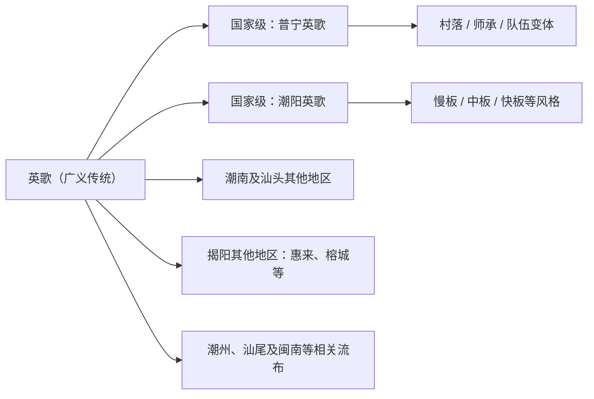

# 英歌舞知识库总纲

> [!abstract] 一句话认识英歌
> 英歌（常称“英歌舞”）是流行于粤东潮汕及周边地区、融舞蹈、南拳套路和戏曲表演于一体的民间广场艺术。2006年，“英歌（普宁英歌、潮阳英歌）”列入第一批国家级非物质文化遗产名录，项目编号为 **Ⅲ—8**。

## 快速入口

| 我想了解 | 推荐入口 |
|---|---|
| 5分钟建立整体认识 | 本页 → [[01_历史渊源]] → [[03_表演形式]] |
| 看懂一场英歌表演 | [[23_演出结构详解]] → [[16_核心角色详解]] → [[15_阵法与队形详解]] |
| 比较地区与流派 | [[25_地域谱系与代表队伍]] → [[14_快板中板慢板详解]] → [[18_普宁各村特色详解]] |
| 了解文化与仪式 | [[07_节庆与仪式]] → [[11_文化内涵深度解析]] → [[21_傩文化渊源详解]] |
| 学习、教学或组队 | [[26_训练体系与安全规范]] → [[28_校园课程与公众教育]] |
| 做论文或田野调查 | [[10_学术研究]] → [[27_田野调查方法与访谈提纲]] → [[31_权威来源与参考书目]] |
| 核查网络说法 | [[30_常见争议与事实辨析]] |
| 建数字档案 | [[29_数字化采集与档案规范]] |

## 知识地图（52篇）

### 一、基础认识

- [[01_历史渊源]]：起源说、历史演变、名称与分布
- [[02_文化意义]]：英雄叙事、祈福禳灾、社区认同
- [[03_表演形式]]：动作、节奏、队形与舞台结构
- [[04_角色与脸谱]]：角色分工与脸谱系统
- [[05_道具与服饰]]：英歌槌、服装、头饰和乐器

### 二、社会文化与非遗

- [[06_流派与传承]]：传承主体、机制、困境与创新
- [[07_节庆与仪式]]：春节、游神、庙会与空间秩序
- [[08_非遗保护]]：名录制度、保护实践与伦理
- [[09_影像资料]]：影像类型与检索入口
- [[10_学术研究]]：研究领域、方法和问题意识
- [[11_文化内涵深度解析]]：象征、记忆与地方社会
- [[12_女子英歌]]：女性参与、队伍实践与性别视角
- [[13_传播与影响]]：短视频、文旅、跨界与海外传播

### 三、表演本体

- [[14_快板中板慢板详解]]：板式差异及地域变体
- [[15_阵法与队形详解]]：队形、调度与领舞
- [[16_核心角色详解]]：头槌、二槌、时迁等
- [[17_脸谱绘制技法详解]]：绘制流程与地方差异
- [[19_英歌槌制作工艺详解]]：材料、规格和使用
- [[20_南派武术融合详解]]：步型、身法、发力与训练
- [[22_锣鼓乐器与曲牌详解]]：锣鼓编制和动作配合
- [[23_演出结构详解]]：前棚、后棚与现代舞台

### 四、地域、实践与研究工具

- [[18_普宁各村特色详解]]：普宁村落个案
- [[21_傩文化渊源详解]]：傩文化关联及学术边界
- [[24_术语表与概念辨析]]：名称、角色、动作和研究术语
- [[25_地域谱系与代表队伍]]：潮阳、普宁及周边地区比较
- [[26_训练体系与安全规范]]：从入门到合练的训练框架
- [[27_田野调查方法与访谈提纲]]：访谈、观察和研究伦理
- [[28_校园课程与公众教育]]：课程设计、评价与适龄改编
- [[29_数字化采集与档案规范]]：视频、音频、照片和元数据
- [[30_常见争议与事实辨析]]：纠正常见绝对化表述
- [[31_权威来源与参考书目]]：来源分级与核心资料入口
- [[35_代表队伍档案]]：经公开资料核实的队伍个案与待补字段
- [[36_动作与步法词典]]：槌法、步法、队形和角色动作的地域化词典
- [[37_潮南惠来及周边地区档案]]：补充潮南、惠来、甲子与潮安等薄弱区域
- [[38_脸谱服饰视觉辨识指南]]：按队伍记录脸谱服饰，规范图片辨识边界
- [[39_锣鼓节奏与声音档案]]：锣鼓、吆喝、槌击的采集与关联记录
- [[40_历史年表与证据分层]]：从起源说到当代传播的分级年表
- [[41_传承人与保护单位档案]]：核准传承人身份、项目与保护机构
- [[42_历史文献证据目录]]：地方志、报刊、影像与口述史回溯路径
- [[43_仪式流程与巡游空间]]：出队、停演点、路线和观众礼仪
- [[44_队伍组织经费与社区协作]]：队务、后勤、财务、志愿者和治理
- [[45_侨乡网络与海外传播类型]]：区分出访、展示、教学与长期传承
- [[46_潮汕文化生态关系图谱]]：英歌与戏曲、武术、音乐、信俗的关系
- [[47_英歌与相关表演形态比较]]：对比醒狮、舞龙、潮剧、标旗与社火
- [[48_潮汕方言称谓与表演空间]]：地方术语、祠堂庙埕和城市巡游空间
- [[49_旧库逐篇证据审计]]：01—23篇的风险、状态与重写优先级
- [[50_核心事实注册表]]：高频事实、适用范围、权威来源和禁止推论
- [[51_标准问答扩展集]]：Q041—Q100，与基础问答合计100条

### 五、智能体与H5接入

- [[32_智能体产品设计与知识架构]]：产品定位、回答结构、RAG切块与验收指标
- [[33_智能体标准问答集]]：快捷问答和回归测试基准
- [[34_智能体内容运营与数据闭环]]：未命中问题、人工审核与版本运营
- `agent/system_prompt.md`：可直接用于服务端的系统提示词
- `agent/intents.json`：意图、实体、风险和知识路由
- `agent/faq.json`：机器可读标准问答
- `agent/knowledge_manifest.json`：知识文件与检索权重清单
- `agent/h5_api_contract.md`：H5聊天接口、安全和流式返回建议

## 先记住的十个要点

1. 正式项目名为“英歌”，公众语境常称“英歌舞”。
2. 国家级名录项目编号是 **Ⅲ—8**，不是Ⅲ—17。
3. 首批国家级名录同时包括普宁英歌与潮阳英歌两个申报地区。
4. “三百多年”属于名录资料采用的传统说法，不等于已有连续三百年的完整文献链。
5. 《水浒传》叙事影响深远，但起源仍有尚武习俗、秧歌、傩文化等多种解释。
6. 队伍人数没有全国统一“标准值”；常见双数编制，可从十余人到一百零八人。
7. 快板、中板、慢板首先是节奏和套路风格，不宜简单对应成三个固定城市。
8. 脸谱、角色、槌法和阵法因村落、师承与演出场景而异。
9. 英歌不仅是舞台节目，也嵌入节庆、游神、社区组织和地方认同。
10. 当代传播扩大了影响，也带来表演压缩、符号化、版权、安全和社区主体性等新问题。

## 资料可信度规则

本库采用四级来源标记：

| 等级 | 来源 | 适合支持的内容 |
|---|---|---|
| A | 国家/省市政府、国家非遗名录、保护单位公开资料 | 项目名称、名录、时间、保护单位 |
| B | 学术专著、核心论文、地方志、正式调查报告 | 历史、艺术形态、社会功能 |
| C | 传承人访谈、队伍官方发布、博物馆与文化馆资料 | 本队套路、口述史、制作与训练细节 |
| D | 新闻、自媒体、短视频、商业宣传 | 当代活动线索和传播现象 |

> [!warning] 编辑原则
> D级来源中的播放量、队伍数量、“唯一”“最早”“正宗”“发源地”等说法，只能作为线索，不能不加限定地写成事实。历史起源应使用“相传”“有观点认为”“名录资料表述为”等措辞。

## 地域关系简图

## 维护清单

- [x] 建立主题导航、术语表、争议辨析和来源索引
- [x] 补充训练、教学、田野调查与数字档案模块
- [ ] 为01—23篇逐条添加行内来源
- [ ] 建立代表队伍卡片，记录队名、地点、板式、师承、活跃年代
- [ ] 建立动作词典：名称、节拍、方向、身体部位、视频时间码
- [ ] 收集地方志、保护规划、代表性传承人访谈和节目单

## 引用

核心事实来源见 [[31_权威来源与参考书目]]。引用本库时，请回到原始来源核对，不把本库当作最终文献。
