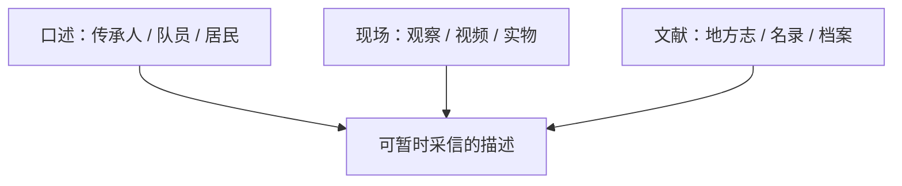

# 田野调查方法与访谈提纲

史料与来源分级参见 [[31_权威来源与参考书目]]、[[42_历史文献证据目录]]。

## 调查前

1. 明确问题：研究动作、组织、仪式、历史还是传播。
2. 查地方志、非遗名录、队伍公开账号和既有论文，避免重复询问。
3. 通过文化馆、村社或熟人建立联系，说明身份、用途和成果形式。
4. 准备知情同意、影像授权、匿名选项和资料返还方案。
5. 不把春节期间的单次展演当作全年常态。

## 观察清单

### 人

- 谁是召集人、教练、司鼓、头槌和器材管理者？
- 新成员如何加入？谁有资格决定角色与站位？
- 老、中、青三代如何分工？女性与儿童参与方式如何变化？

### 动作

- 起势、基本步、槌法和收势分别有何口令？
- 同一动作的地方名称、节拍数和身体路线是什么？
- 排练与正式演出有何不同？失误如何处理？

### 空间

- 祠堂、庙埕、村道、广场和舞台如何改变队形？
- 队伍经过哪些地点，在哪里停留、转向或加演？
- 观众、神轿、乐队、摄影者和交通如何共享空间？

### 声音

- 鼓、锣、钹、螺号、口令、吆喝分别何时出现？
- 司鼓用什么信号控制速度和变阵？
- 可否录制独立声部，便于后期分析？

## 半结构访谈提纲

访谈开始前先说明研究用途、录音录像方式、公开范围与撤回方式，并取得知情同意；以下问题不能替代伦理说明。

### 传承人/教练

- 您何时、向谁学习？当时怎样选人和训练？
- 本队最能区别于其他队伍的动作、锣鼓或阵法是什么？
- 哪些内容已经不演？为什么改变？
- 哪些说法来自师傅口传，哪些有文字或影像证据？
- 舞台、比赛、短视频和商业邀请分别带来什么变化？

### 队员

- 为什么加入？家人和工作单位是否支持？
- 最难学、最容易受伤和最有成就感的部分是什么？
- 怎样理解脸谱角色和“英雄”？
- 队内纪律、费用、服装和演出机会如何安排？

### 社区居民/观众

- 什么场合必须有英歌？缺席意味着什么？
- 哪支队伍、哪种风格最熟悉？判断“好看/正宗”的标准是什么？
- 近十年观众、路线、时间和氛围有哪些变化？

### 文化管理者

- 项目档案、传承人认定和经费如何运作？
- 校园、文旅、赛事和商业合作如何评估？
- 保护中最缺的是人、场地、资金、资料还是制度？

## 研究伦理

- 录音录像前取得明确同意；同意采访不等于同意公开脸部或完整套路。
- 对未公开的师承争议、收入、内部矛盾和宗教细节谨慎处理。
- 对“秘传”“正宗”不站队，记录不同主体的原话和语境。
- 向社区返还照片、整理稿、字幕或数字副本，并允许纠正事实错误。
- 发表时注明观察日期；传统会变化，记录不是永久标准答案。

## 资料三角验证

同一关键事实尽量由三类材料互证：

若材料冲突，不强行合并，可写成“甲方叙述—乙方叙述—现有证据—待核问题”。
