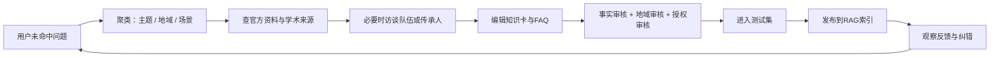

# 英歌舞智能体内容运营与数据闭环

内容审核以 [[50_核心事实注册表]] 为事实基准，以 [[31_权威来源与参考书目]] 为来源政策。

## 仍然缺少的数据

现有知识库可支持基础问答，但要成为有竞争力的智能体，还需持续补充：

| 数据层 | 当前状态 | 下一步 |
|---|---|---|
| 通识知识 | 基本具备 | 为01—23逐条补脚注 |
| 地域/队伍 | 只有概括 | 建立一队一卡和师承关系 |
| 动作知识 | 有名称、缺标准样本 | 建动作视频时间码词典 |
| 锣鼓知识 | 偏文字概括 | 录独立声部与口传拟声谱 |
| 人物资料 | 零散且易混 | 对接官方名录与授权访谈 |
| 实时活动 | 静态库不适合 | 接活动、票务、交通接口 |
| 多媒体版权 | 未成体系 | 建授权、公开级别和撤回机制 |
| 用户问题 | 尚未沉淀 | 上线后收集匿名未命中问题 |

## 内容生产流水线



## 问题日志

只记录改进产品所需的最少数据：

```json
{
  "question_id": "匿名ID",
  "timestamp": "ISO-8601",
  "normalized_question": "用户问题去除个人信息后的版本",
  "intent": "performance.role",
  "region": "未知",
  "retrieved_chunk_ids": [],
  "answer_confidence": 0.72,
  "user_feedback": "有帮助|没帮助|事实错误|太长|没回答",
  "escalation_reason": "知识缺口|实时信息|地区不明|来源冲突"
}
```

不要默认保存原始IP、精确位置、上传者人脸、完整聊天或未成年人信息。

## 人工审核队列

以下问题自动进入人工审核：

- 涉及“国家级传承人”“发源地”“唯一正宗”等身份或声誉判断；
- 两个A级/B级来源相互冲突；
- 用户提交新的队伍、人物、历史照片或口述史；
- 涉及未成年人、信俗内部仪式、版权或商业授权；
- 智能体置信度低于0.55但用户要求确定答案；
- 活动信息可能已经变化。

## 版本管理

每次发布保留：

- `knowledge_version`：如`2026.07.28.1`；
- 变更文件和变更原因；
- 新增/删除/修改的知识块ID；
- 评测集结果；
- 审核人；
- 可回滚的上一版索引。

## 上线后的每周看板

- 问题总量、有效会话量；
- 前20个意图与未命中问题；
- 引用点击率；
- 用户纠错数与已解决比例；
- 地域分布（仅粗粒度、自愿提供）；
- 高风险回答触发数；
- 无答案率、重复追问率和平均回答长度；
- 知识更新延迟。

## 内容优先级

采用 `用户频率 × 事实风险 × 文化价值 ÷ 制作成本` 排序。

第一批应制作：

1. 20—50个标准FAQ；
2. 普宁、潮阳各5—10支代表队伍卡；
3. 30个高频动作/角色术语；
4. 10个常见误解辨析；
5. 5条现场看演出导览路线；
6. 适合儿童、游客、研究者的三套回答长度。
