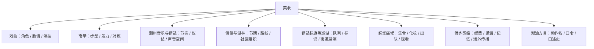

# 英歌与潮汕文化生态关系图谱

## 核心判断

英歌不是孤立的舞蹈项目。它与潮汕的戏曲、音乐、武术、信俗、巡游、建筑空间、侨乡网络和地方语言共享表演资源与社会场景。但“共享元素”不等于“直接起源”或“从属关系”。



## 与潮剧及地方戏曲

可能共享：

- 梁山人物和英雄叙事；
- 净角等脸谱造型资源；
- 头冠、雉尾、武侠服饰与兵器意象；
- 程式化身段和人物性格表达；
- 前棚、后棚中的戏剧性段落。

不能简单断言：

- 英歌脸谱完全照搬潮剧；
- 某个角色颜色在所有队伍固定不变；
- 英歌直接由潮剧演变而来。

潮剧和英歌都是2006年列入第一批国家级非遗名录的重要潮汕项目，但属于不同项目体系。

## 与潮州音乐、潮州大锣鼓

国家非遗资料将潮州音乐概括为潮州地区各类民间器乐总称，包含广场乐和室内乐；广场乐中包括潮州大锣鼓、外江锣鼓乐、小锣鼓等。

英歌与其关系可从以下方面研究：

- 乐器是否来自当地锣鼓传统；
- 司鼓口传与潮州大锣鼓谱系是否相通；
- 巡游声场、仪仗性和群体调度；
- 同一乐师是否跨项目演奏；
- 英歌自己的循环鼓点与大型套曲之间的区别。

英歌有锣鼓伴奏，不等于所有伴奏都可统称“潮州大锣鼓”。

来源：[中国非物质文化遗产网：潮州音乐](https://www.ihchina.cn/project_details/12553.html)

## 与南拳和地方武术

英歌公开资料常强调融合南拳套路或南拳散手。比较维度包括：

- 马步、弓步、低重心与步幅；
- 肩、腰、胯联动的发力；
- 转身、进退、对击和防护距离；
- 武德、纪律和师徒教学；
- 后棚兵器与对练。

但舞蹈动作经过节奏化、队列化和角色化处理，不应直接等同于实战拳术。地方规划所列南枝拳、李家教拳等，也不能在没有师承证据时直接写成英歌的来源。

## 与游神和民间信俗

- 英歌可能参与春节、神诞或游神赛会；
- 英歌队、神轿、标旗、锣鼓和舞龙舞狮可能共享路线；
- 村社组织、庙宇和乡贤网络会共同参与筹备；
- 英歌承担迎祥纳福、展示社区力量等文化功能。

英歌不等于游神，游神也不必然包含英歌。具体关系见 [[43_仪式流程与巡游空间]]。

## 与锣鼓标旗巡游

揭阳市相关规划列出省级“锣鼓标旗巡游”和市级“普宁大锣鼓标旗巡游”等项目。它们与英歌可能共享：

- 节庆时间；
- 街道巡游；
- 声音、色彩和队列；
- 村社、乡贤与观众组织；
- 城市文旅展演。

需要分别记录项目名、队伍、路线和组织者，不能将标旗队自动算作英歌队的一部分。

## 与醒狮、舞龙及其他群体表演

共同点：

- 锣鼓伴奏；
- 节庆和开张等场景；
- 武术身体训练；
- 社区、师徒和青年组织；
- 强烈的视觉与声音效果。

差异：

- 英歌以持槌群舞、人物脸谱和队形变化为核心；
- 醒狮以狮具操演、采青和双人配合等为核心；
- 舞龙围绕龙具、龙珠和多人协作；
- 各项目的名录、师承和仪式规则不同。

## 与春节

2024年12月，“春节——中国人庆祝传统新年的社会实践”列入联合国教科文组织人类非物质文化遗产代表作名录。英歌是潮汕地区春节实践中可见的一种表演，但不能因此说“英歌已经单独列入人类非遗”。

来源：[中国非物质文化遗产网：在广东邂逅更多春节“打开方式”](https://www.ihchina.cn/news_1_details/31504.html)

## 与侨乡文化

侨胞可能通过捐助、返乡观看、邀请出访、收藏旧照片和组织海外节庆参与英歌。详细分类见 [[45_侨乡网络与海外传播类型]]。

## 关系证据卡

```yaml
relationship_id:
英歌队伍:
相关项目:
关系类型: 同场/共享乐师/师承/共用路线/服饰借鉴/跨界改编
地区:
日期:
具体证据:
是否双向:
来源:
不能推出的结论:
```
